# LOs Generation System Architecture - v8.1 (Hybrid Chunking)

## Introduction

This document outlines the complete architecture for the Learning Objectives Generation system with **Hybrid Chunking Pipeline** support. The system now intelligently handles both native PDFs (with selectable text) and scanned PDFs (image-based) through a dual-path processing approach.

### Architecture Evolution: v8.0 → v8.1

**Key Enhancement:** **Hybrid Chunking Pipeline**
- **Problem Solved:** Original pipeline failed on scanned PDFs (image-only documents)
- **Solution:** Intelligent document type detection with dual processing paths
- **Impact:** Universal PDF processing capability for all document types

## High Level Architecture

### Technical Summary

The LOs Generation system is a **hybrid document processing pipeline** that automatically detects PDF types and routes them through appropriate processing paths. **Native PDFs** use structural chunking for optimal performance, while **scanned PDFs** undergo OCR processing followed by AI-powered agentic chunking. The system maintains the existing FastAPI + Celery + PostgreSQL + Qdrant architecture while adding intelligent document analysis and OCR capabilities.

### Hybrid Chunking Architecture Diagram

```mermaid
graph TB
    %% Document Input
    PDF[📄 Input PDF Document] --> Analyzer[🔍 Document Analyzer Service]
    
    %% Document Type Detection
    Analyzer --> Decision{Document Type?}
    
    %% Native PDF Path (Path A)
    Decision -->|Native PDF<br/>Selectable Text| PathA[🏗️ Structural Chunking Path]
    PathA --> StructuralChunker[📋 Structural Chunker]
    StructuralChunker --> HeaderSplitter[📑 MarkdownHeaderTextSplitter<br/>Parent Chunks]
    HeaderSplitter --> RecursiveSplitter[✂️ RecursiveCharacterTextSplitter<br/>Child Chunks]
    
    %% Scanned PDF Path (Path B) 
    Decision -->|Scanned PDF<br/>Image-Based| PathB[🤖 OCR + Agentic Path]
    PathB --> OCRService[👁️ OCR Service<br/>Tesseract]
    OCRService --> ImagePreprocess[🖼️ Image Preprocessing<br/>OpenCV + Pillow]
    ImagePreprocess --> TextExtraction[📝 Text Extraction<br/>pytesseract]
    TextExtraction --> AgenticChunker[🧠 Agentic Chunker<br/>Gemini Flash + Pydantic AI]
    
    %% Convergence Point
    RecursiveSplitter --> Indexing[💾 Vector Indexing<br/>Qdrant + bge-m3]
    AgenticChunker --> Indexing
    
    %% Storage
    Indexing --> Storage[(🗄️ PostgreSQL<br/>Parent & Child Chunks)]
    Indexing --> VectorDB[(🔍 Qdrant<br/>Vector Embeddings)]
    
    %% Monitoring
    PathA --> Monitor[📊 Processing Metrics]
    PathB --> Monitor
    Monitor --> Langfuse[🔬 Langfuse Observability]
```



### Processing Path Comparison

| Aspect | **Path A: Structural** | **Path B: OCR + Agentic** |
|--------|------------------------|---------------------------|
| **Input** | Native PDF (selectable text) | Scanned PDF (images) |
| **Detection** | PyMuPDF text extraction success | PyMuPDF text extraction failure |
| **Preprocessing** | Direct text processing | OCR + image enhancement |
| **Chunking Strategy** | Rule-based structural splitting | AI-powered semantic chunking |
| **Performance** | Fast (~seconds per page) | Slower (~30-60s per page) |
| **Accuracy** | High (preserves formatting) | Good (depends on OCR quality) |
| **Cost** | Low (no LLM calls for chunking) | Higher (Gemini Flash API calls) |

## Components Architecture

### New Components for Hybrid Chunking

#### Document Analyzer Service
**Responsibility:** Detect PDF type and route to appropriate processing path

**Key Interfaces:**
- `analyze_pdf_type(file_path: str) -> DocumentType`
- `extract_sample_pages(pdf_path: str) -> List[PageSample]`
- `calculate_text_density(page: PageSample) -> float`

**Decision Logic:**
```python
def analyze_pdf_type(self, file_path: str) -> DocumentType:
    """Analyze PDF to determine if it's native or scanned."""
    doc = fitz.open(file_path)
    total_pages = len(doc)
    text_pages = 0
    
    # Sample first 5 pages or all pages if less than 5
    sample_size = min(5, total_pages)
    
    for page_num in range(sample_size):
        page = doc[page_num]
        text = page.get_text().strip()
        
        # Check if page has meaningful text (not just OCR artifacts)
        if len(text) > 50 and self._is_meaningful_text(text):
            text_pages += 1
    
    # Threshold: >80% of sampled pages must have meaningful text
    if (text_pages / sample_size) > 0.8:
        return DocumentType.NATIVE
    else:
        return DocumentType.SCANNED
```

#### OCR Service
**Responsibility:** Convert scanned PDF pages to searchable text using Tesseract OCR

**Key Interfaces:**
- `process_pdf_page(page_image: PIL.Image) -> OCRResult`
- `enhance_image_quality(image: PIL.Image) -> PIL.Image`
- `detect_text_language(text: str) -> LanguageCode`

**Technology Stack:** 
- pytesseract (Python wrapper)
- Tesseract OCR Engine (system dependency)
- Pillow (image processing)
- OpenCV (advanced image enhancement)

#### Agentic Chunker Service
**Responsibility:** AI-powered semantic chunking of OCR-extracted text

**Key Interfaces:**
- `chunk_ocr_content(raw_text: str, page_context: PageContext) -> ChunkingResult`
- `validate_chunk_quality(chunks: List[Chunk]) -> QualityScore`
- `optimize_chunk_boundaries(chunks: List[Chunk]) -> List[Chunk]`

**Agentic Chunker Prompt:**
```yaml
role: |
  You are an expert document analyst specializing in semantic chunking of 
  unstructured text from OCR output. Your task is to analyze raw text and 
  intelligently group it into logical, contextually complete chunks.

context: |
  This text was extracted via OCR and may contain formatting errors, 
  missing punctuation, or lack clear structural separators. Your goal 
  is to identify thematic shifts and logical groupings based on content 
  semantic meaning rather than formatting cues.

input_format: |
  Raw OCR text from page {page_number}:
  "{raw_text}"

task: |
  1. Read the entire text and identify logical breaks and thematic groupings
  2. Create Parent Chunks that span coherent concepts (can be multiple paragraphs)
  3. Split each Parent Chunk into sentence-level Child Chunks
  4. Ensure semantic coherence and avoid splitting mid-concept

output_schema: |
  ChunkingResult:
    parent_chunks: List[ParentChunk]
      - content: str
      - thematic_summary: str
      - confidence_score: float (0.0-1.0)
      - child_chunks: List[ChildChunk]
        - content: str
        - sequence_number: int
        - semantic_role: str  # "introduction", "main_point", "example", "conclusion"

quality_criteria: |
  - Parent chunks should be 200-800 words
  - Child chunks should be complete sentences or thoughts
  - Maintain semantic coherence within chunks
  - Avoid breaking concepts across chunk boundaries
  - Handle OCR errors gracefully (don't split on obvious OCR mistakes)
```

## Updated Workflows

### Master Workflow: Hybrid Document Processing


### Error Handling in Hybrid Pipeline


## Database Schema Updates

### Enhanced Parent Chunks Table

```sql
-- Updated parent_chunks table with hybrid chunking support
ALTER TABLE parent_chunks ADD COLUMN 
    document_type VARCHAR(20) DEFAULT 'native' NOT NULL,
    processing_path VARCHAR(30) DEFAULT 'structural' NOT NULL,
    ocr_confidence INTEGER CHECK (ocr_confidence >= 0 AND ocr_confidence <= 100),
    ocr_language_detected VARCHAR(10),
    image_preprocessing_applied JSONB,
    
-- New indexes for hybrid chunking
CREATE INDEX idx_parent_chunk_document_type ON parent_chunks(document_type);
CREATE INDEX idx_parent_chunk_processing_path ON parent_chunks(processing_path);
CREATE INDEX idx_parent_chunk_ocr_confidence ON parent_chunks(ocr_confidence);

-- Migration path for existing data
UPDATE parent_chunks SET 
    document_type = 'native',
    processing_path = 'structural'
WHERE document_type IS NULL;
```

### Processing Jobs Enhancement

```sql
-- Enhanced processing_jobs table for hybrid tracking
ALTER TABLE processing_jobs ADD COLUMN
    document_type VARCHAR(20),
    processing_path VARCHAR(30),
    ocr_pages_processed INTEGER DEFAULT 0,
    ocr_average_confidence DECIMAL(3,2),
    agentic_chunking_tokens_used INTEGER DEFAULT 0;

-- Indexes for monitoring and analytics
CREATE INDEX idx_jobs_document_type ON processing_jobs(document_type);
CREATE INDEX idx_jobs_processing_path ON processing_jobs(processing_path);
```

## Performance Considerations

### Processing Time Estimates

| Document Type | Processing Path | Time per Page | Bottleneck |
|---------------|----------------|---------------|------------|
| **Native PDF** | Structural | 0.1-0.5 seconds | Text parsing |
| **Scanned PDF (Good Quality)** | OCR + Agentic | 15-30 seconds | OCR processing |
| **Scanned PDF (Poor Quality)** | OCR + Agentic | 45-90 seconds | Image enhancement + OCR |

### Scaling Strategy

1. **Horizontal Scaling:** Multiple Celery workers with OCR-specific queues
2. **Resource Optimization:** Separate worker pools for OCR-heavy tasks
3. **Caching:** Cache OCR results for identical pages/documents
4. **Preprocessing:** Batch image enhancement operations

### Cost Optimization

1. **Smart Sampling:** Only OCR representative pages for quality assessment
2. **Model Selection:** Use Gemini Flash (cheaper) for chunking, Pro for quality scoring
3. **Caching Strategy:** Store processed chunks to avoid re-processing
4. **Quality Thresholds:** Skip low-quality pages that won't produce useful LOs

## Quality Assurance

### OCR Quality Validation

```python
class OCRQualityValidator:
    def validate_ocr_result(self, ocr_result: OCRResult) -> QualityAssessment:
        """Validate OCR output quality and confidence."""
        assessment = QualityAssessment()
        
        # Check text coherence
        assessment.text_coherence = self._check_coherence(ocr_result.text)
        
        # Validate language detection
        assessment.language_confidence = self._validate_language(
            ocr_result.text, 
            ocr_result.detected_language
        )
        
        # Check for common OCR errors
        assessment.ocr_artifacts = self._detect_artifacts(ocr_result.text)
        
        # Overall confidence score
        assessment.overall_confidence = min(
            ocr_result.confidence,
            assessment.text_coherence,
            assessment.language_confidence
        )
        
        return assessment
```

### Agentic Chunking Quality Control

```python
class AgenticChunkingValidator:
    def validate_chunks(self, chunks: List[Chunk], original_text: str) -> ValidationResult:
        """Validate AI-generated chunks for quality and completeness."""
        
        # Check coverage - ensure no content is lost
        coverage_score = self._calculate_coverage(chunks, original_text)
        
        # Check semantic coherence within chunks
        coherence_score = self._assess_semantic_coherence(chunks)
        
        # Check chunk size distribution
        size_distribution = self._analyze_chunk_sizes(chunks)
        
        # Check for concept splitting
        concept_integrity = self._assess_concept_integrity(chunks)
        
        return ValidationResult(
            coverage_score=coverage_score,
            coherence_score=coherence_score,
            size_distribution=size_distribution,
            concept_integrity=concept_integrity,
            requires_retry=coverage_score < 0.85 or coherence_score < 0.80
        )
```

## Configuration Management

### OCR Configuration

```yaml
# configs/ocr.yaml
ocr:
  tesseract:
    # Language models to load
    languages: ['eng', 'tha']
    
    # OCR Engine Modes
    page_segmentation_mode: 3  # Fully automatic page segmentation
    ocr_engine_mode: 3         # Default Tesseract LSTM engine
    
    # Quality thresholds
    minimum_confidence: 60     # Skip pages below this confidence
    retry_with_preprocessing: true
    
  image_preprocessing:
    # Image enhancement settings
    denoise: true
    sharpen: true
    contrast_adjustment: true
    dpi_upscaling: 300
    
    # Advanced preprocessing for poor quality images
    morphological_operations: true
    adaptive_thresholding: true

agentic_chunking:
  # Gemini Flash configuration for chunking
  model: "gemini-2.5-flash"
  
  # Chunking parameters
  target_parent_chunk_size: 500  # Target words per parent chunk
  max_child_chunks_per_parent: 10
  
  # Quality control
  min_chunk_confidence: 0.75
  retry_attempts: 3
  fallback_to_simple_splitting: true
  
  # Cost control
  max_tokens_per_request: 8000
  batch_processing: true
```

### Monitoring Configuration

```yaml
# configs/monitoring.yaml
hybrid_chunking_metrics:
  # Processing path distribution
  track_processing_paths: true
  alert_on_path_imbalance: true
  
  # OCR performance monitoring
  ocr_confidence_tracking: true
  low_confidence_threshold: 70
  
  # Agentic chunking monitoring
  track_token_usage: true
  monitor_chunk_quality_scores: true
  alert_on_quality_degradation: true
  
  # Cost tracking
  track_gemini_api_costs: true
  monthly_budget_alerts: true
```

## Deployment Updates

### Docker Configuration Updates

```dockerfile
# Updated Dockerfile with OCR dependencies
FROM python:3.10-slim

# Install system dependencies including Tesseract
RUN apt-get update && apt-get install -y \
    tesseract-ocr \
    tesseract-ocr-tha \
    tesseract-ocr-eng \
    libtesseract-dev \
    libopencv-dev \
    python3-opencv \
    && rm -rf /var/lib/apt/lists/*

# Install Python dependencies
COPY pyproject.toml poetry.lock ./
RUN pip install poetry && poetry install --no-dev

# Set Tesseract data path
ENV TESSDATA_PREFIX=/usr/share/tesseract-ocr/5/tessdata/

# Copy application code
COPY src/ ./src/
COPY configs/ ./configs/

# Health check including OCR capability
HEALTHCHECK --interval=30s --timeout=10s --start-period=60s \
  CMD python -c "import pytesseract; pytesseract.get_tesseract_version()" || exit 1

CMD ["uvicorn", "src.main:app", "--host", "0.0.0.0", "--port", "8000"]
```

### Environment Variables

```bash
# OCR Configuration
TESSERACT_CMD=/usr/bin/tesseract
TESSDATA_PREFIX=/usr/share/tesseract-ocr/5/tessdata/
OCR_DEFAULT_LANGUAGE=eng+tha
OCR_CONFIDENCE_THRESHOLD=60

# Agentic Chunking
AGENTIC_CHUNKING_ENABLED=true
GEMINI_FLASH_API_KEY=your_api_key_here
CHUNKING_MAX_RETRIES=3
CHUNKING_TIMEOUT_SECONDS=120

# Monitoring
ENABLE_OCR_METRICS=true
ENABLE_COST_TRACKING=true
LANGFUSE_OCR_TRACING=true
```

## Testing Strategy

### OCR Testing

```python
class TestOCRService:
    def test_native_pdf_detection(self):
        """Test that native PDFs are correctly identified."""
        pass
        
    def test_scanned_pdf_detection(self):
        """Test that scanned PDFs are correctly identified."""
        pass
        
    def test_ocr_quality_thresholds(self):
        """Test OCR quality validation and thresholds."""
        pass
        
    def test_image_preprocessing_pipeline(self):
        """Test image enhancement improves OCR results."""
        pass

class TestAgenticChunker:
    def test_semantic_chunking_quality(self):
        """Test that AI chunking produces semantically coherent results."""
        pass
        
    def test_chunk_coverage_completeness(self):
        """Test that no content is lost during chunking."""
        pass
        
    def test_fallback_mechanisms(self):
        """Test fallback when AI chunking fails."""
        pass
```

### Integration Testing

```python
class TestHybridPipeline:
    def test_end_to_end_native_pdf(self):
        """Test complete pipeline for native PDF."""
        pass
        
    def test_end_to_end_scanned_pdf(self):
        """Test complete pipeline for scanned PDF."""
        pass
        
    def test_pipeline_fallback_scenarios(self):
        """Test fallback from native to OCR path."""
        pass
        
    def test_performance_benchmarks(self):
        """Test processing time stays within acceptable limits."""
        pass
```

## Migration Strategy

### Phase 1: Infrastructure Setup
1. **Deploy OCR dependencies** to all environments
2. **Update database schema** with new hybrid chunking fields
3. **Deploy new service components** (Document Analyzer, OCR Service, Agentic Chunker)

### Phase 2: Parallel Processing
1. **Enable hybrid detection** but route all to existing structural path initially
2. **Test OCR path** on a subset of known scanned documents
3. **Validate quality** and performance metrics

### Phase 3: Full Deployment
1. **Enable automatic routing** based on document type detection
2. **Monitor performance** and quality metrics
3. **Optimize configurations** based on real-world usage

### Rollback Plan
1. **Feature flag** to disable hybrid chunking and route all documents to structural path
2. **Database rollback scripts** to revert schema changes if needed
3. **Service rollback** to previous version if critical issues arise

---

This Hybrid Chunking Pipeline architecture ensures the LOs Generation system can handle all types of PDF documents while maintaining performance and quality standards. The intelligent routing system optimizes processing paths based on document characteristics, providing universal PDF processing capability.