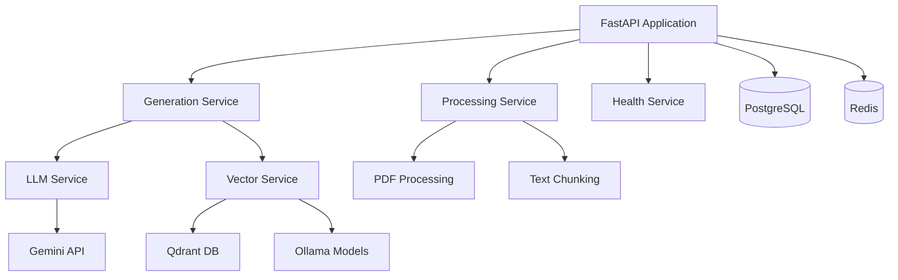

# Developer Guide - LOs Generation Pipeline

## 🚀 Quick Start

### Prerequisites
- Python 3.10+ 
- Docker & Docker Compose
- Git
- A Gemini API key from [Google AI Studio](https://ai.google.dev/)

### 1. Environment Setup

```bash
# Clone the repository
git clone <repository-url>
cd LOs_Generation

# Copy environment variables
cp .env.example .env

# Edit .env with your actual values (especially GEMINI_API_KEY)
nano .env
```

### 2. Installation

```bash
# Install Poetry (dependency manager)
curl -sSL https://install.python-poetry.org | python3 -

# Install dependencies
poetry install

# Activate virtual environment
poetry shell
```

### 3. Database Setup

```bash
# Start infrastructure services
docker-compose up -d postgres redis qdrant ollama

# Run database migrations
poetry run alembic upgrade head
```

### 4. Pull Required Models

```bash
# Pull embedding models (may take time)
docker exec -it los_generation-ollama-1 ollama pull qwen/qwen3-embedding-8b
docker exec -it los_generation-ollama-1 ollama pull bge-m3:latest
```

### 5. Start Development Server

```bash
# Start the API server
poetry run uvicorn src.main:app --host 0.0.0.0 --port 8000 --reload

# In another terminal, start Celery worker
poetry run celery -A src.tasks.celery_app worker --loglevel=info
```

### 6. Verify Installation

```bash
# Check API health
curl http://localhost:8000/health

# Run tests
poetry run pytest tests/services/ -v
```

---

## 🏗️ Architecture Overview

### Services Architecture



### Service Responsibilities

| Service | Purpose | Key Dependencies |
|---------|---------|------------------|
| **LLM Service** | Gemini API integration, content generation | Google Gemini API |
| **Vector Service** | Embedding generation, similarity search | Qdrant, Ollama |
| **Processing Service** | PDF processing, text chunking | PyMuPDF, LangChain |
| **Generation Service** | Learning objective creation, quality scoring | LLM + Vector Services |
| **Health Service** | System monitoring, diagnostics | All other services |

---

## 🛠️ Development Workflow

### Code Style & Standards

```bash
# Format code
poetry run black src tests

# Lint code  
poetry run flake8 src tests

# Type checking
poetry run mypy src

# Run all quality checks
poetry run pre-commit run --all-files
```

### Testing Strategy

```bash
# Run unit tests
poetry run pytest tests/services/ -v -m unit

# Run integration tests  
poetry run pytest tests/integration/ -v -m integration

# Run all tests with coverage
poetry run pytest --cov=src --cov-report=html

# Run performance tests
poetry run pytest tests/ -m performance --benchmark-only
```

### Service Development Pattern

1. **Create Service Class**
   ```python
   from src.services.base import BaseService
   
   class MyService(BaseService):
       def __init__(self):
           super().__init__("MyService")
       
       async def _initialize(self):
           # Service-specific initialization
           pass
       
       async def _shutdown(self):
           # Cleanup logic
           pass
       
       async def health_check(self):
           # Health check implementation
           return {"status": "healthy"}
   ```

2. **Write Tests First**
   ```python
   import pytest
   from src.services.my_service import MyService
   
   class TestMyService:
       @pytest.mark.asyncio
       async def test_service_initialization(self):
           service = MyService()
           await service.initialize()
           assert service.is_initialized()
   ```

3. **Integration Testing**
   ```python
   @pytest.mark.integration
   async def test_service_integration(self):
       # Test service interactions
       pass
   ```

---

## 🔧 Configuration Management

### Environment Variables

| Variable | Description | Required | Default |
|----------|-------------|----------|---------|
| `SECRET_KEY` | Application secret key | ✅ | - |
| `GEMINI_API_KEY` | Google Gemini API key | ✅ | - |
| `DATABASE_URL` | PostgreSQL connection string | ✅ | - |
| `REDIS_URL` | Redis connection string | ✅ | - |
| `QDRANT_URL` | Qdrant vector database URL | ✅ | - |
| `OLLAMA_URL` | Ollama models API URL | ✅ | - |

### Model Configuration

Edit `configs/models.yaml`:

```yaml
embedding_models:
  english:
    name: "qwen3-embed"
    ollama_model: "qwen/qwen3-embedding-8b"
    dimension: 1024
  thai:
    name: "bge-m3"
    ollama_model: "bge-m3:latest"
    dimension: 1024

generation_models:
  primary:
    name: "gemini-2.5-pro"
    provider: "google"
    temperature: 0.1
  validation:
    name: "gemini-2.5-flash"
    provider: "google"
    temperature: 0.1
```

---

## 🐛 Debugging & Troubleshooting

### Common Issues

#### 1. Service Initialization Failures

**Problem**: Services fail to initialize
```bash
# Check service logs
docker-compose logs api

# Verify service connectivity
curl http://localhost:6333/health  # Qdrant
curl http://localhost:11434/api/tags  # Ollama
```

**Solution**:
- Ensure all Docker services are running
- Check API keys and connection strings
- Verify models are pulled in Ollama

#### 2. Model Download Issues

**Problem**: Ollama models not available
```bash
# Check available models
docker exec -it los_generation-ollama-1 ollama list

# Pull missing models
docker exec -it los_generation-ollama-1 ollama pull qwen/qwen3-embedding-8b
```

#### 3. Database Connection Issues

**Problem**: Database connection failures
```bash
# Check PostgreSQL
docker-compose logs postgres

# Test connection
poetry run python -c "
from src.database.connection import get_database_url
print('DB URL:', get_database_url())
"
```

### Development Tools

#### Generate Development API Key
```python
# In Python shell
from src.core.security import create_development_api_key
api_key = create_development_api_key()
print(f"Dev API Key: {api_key}")
```

#### Test Services Manually
```python
# Test LLM Service
from src.services import LLMService
import asyncio

async def test_llm():
    service = LLMService()
    await service.initialize()
    
    result = await service.generate_content("Test generation")
    print(f"Result: {result}")
    
    await service.shutdown()

asyncio.run(test_llm())
```

#### Monitor System Health
```bash
# Check comprehensive system status
curl -H "Authorization: Bearer YOUR_API_KEY" \
     http://localhost:8000/api/v1/health/comprehensive
```

---

## 📊 Performance Optimization

### Database Optimization

```python
# Connection pooling settings in .env
DATABASE_POOL_SIZE=20
DATABASE_MAX_OVERFLOW=30
```

### Vector Database Tuning

```python
# Qdrant performance settings
VECTOR_DIMENSION=1024
MAX_RETRIEVAL_CHUNKS=20
TOP_K_RETRIEVAL=10
```

### Concurrency Settings

```python
# Processing limits
MAX_CONCURRENT_JOBS=5
API_RATE_LIMIT_PER_MINUTE=60
```

---

## 🔍 Monitoring & Observability

### Health Endpoints

| Endpoint | Purpose |
|----------|---------|
| `/health` | Basic API health |
| `/api/v1/health/comprehensive` | Full system status |
| `/api/v1/health/services` | Individual service health |

### Metrics Collection

```python
# Custom metrics in services
from prometheus_client import Counter, Histogram

generation_counter = Counter('los_generation_total', 'Total LO generations')
generation_time = Histogram('los_generation_duration_seconds', 'LO generation time')
```

### Logging

```python
# Structured logging
import structlog

logger = structlog.get_logger(__name__)
logger.info("Processing started", topic="Forces", count=5)
```

---

## 🚀 Deployment

### Development Deployment
```bash
# Full stack with hot reload
docker-compose up --build
```

### Production Deployment
```bash
# Production configuration
docker-compose -f docker-compose.prod.yml up -d

# Health check
curl https://yourdomain.com/health
```

### Scaling
```bash
# Scale API instances
docker-compose up -d --scale api=3

# Scale Celery workers
docker-compose up -d --scale celery-worker=4
```

---

## 📝 API Usage Examples

### Generate Learning Objectives
```bash
curl -X POST "http://localhost:8000/api/v1/generate-los" \
     -H "Authorization: Bearer YOUR_API_KEY" \
     -H "Content-Type: application/json" \
     -d '{
       "topic": "Forces and Motion",
       "target_count": 3,
       "difficulty": "beginner",
       "quality_threshold": 0.7
     }'
```

### Check Generation Status
```bash
curl -X GET "http://localhost:8000/api/v1/generation/{job_id}" \
     -H "Authorization: Bearer YOUR_API_KEY"
```

---

## 🤝 Contributing

### Pull Request Process

1. **Create Feature Branch**
   ```bash
   git checkout -b feature/your-feature-name
   ```

2. **Make Changes & Test**
   ```bash
   # Run full test suite
   poetry run pytest
   
   # Check code quality
   poetry run pre-commit run --all-files
   ```

3. **Commit & Push**
   ```bash
   git commit -m "feat: add your feature description"
   git push origin feature/your-feature-name
   ```

4. **Create Pull Request**
   - Ensure CI passes
   - Include test coverage
   - Update documentation if needed

### Code Review Checklist

- [ ] Tests added for new functionality
- [ ] Documentation updated
- [ ] Type hints included
- [ ] Error handling implemented
- [ ] Logging added appropriately
- [ ] Performance implications considered

---

## 🔗 Additional Resources

- [FastAPI Documentation](https://fastapi.tiangolo.com/)
- [Pydantic AI Documentation](https://ai.pydantic.dev/)
- [Qdrant Documentation](https://qdrant.tech/documentation/)
- [Google Gemini API](https://ai.google.dev/docs)
- [Ollama Documentation](https://ollama.ai/docs)

---

For more help, check the [troubleshooting guide](troubleshooting.md) or create an issue in the repository.